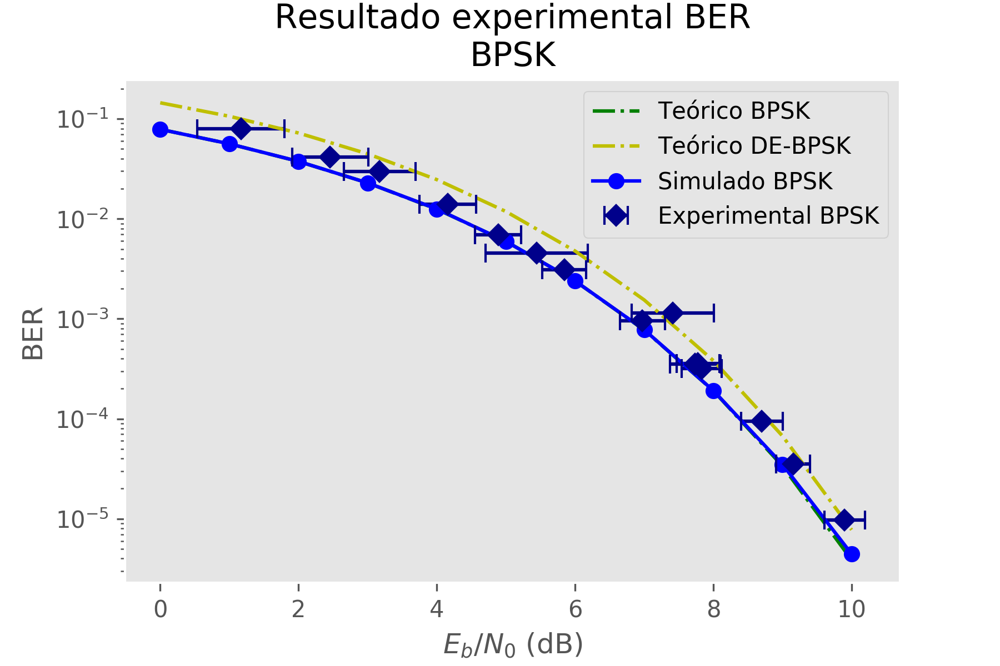
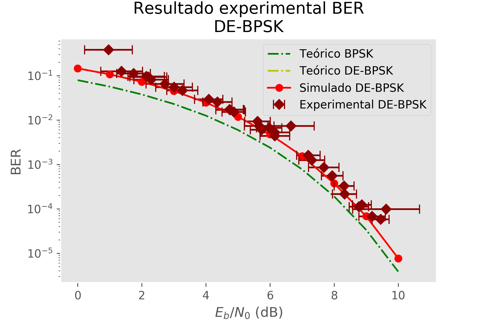

IT++ no GNU Radio (Resultados)
=============================

Branch principal de blocos testes/experimentos/resultados.

# Resultados Práticos Ladams

<!-- ## BER Curve Ladams Diff. Encoding BPSK

/Curva.png)

## BER Curve Ladams Diff. Encoding BCH(15, 7) BPSK

/Curva.png) -->

## 
 BER Curves (Experimental)
BPSK|
:-------------------------:|
 |

DE-BPSK|
:-------------------------:|
 |

DE-BPSK + BCH(15, 7, t = 2) (No interleaving, channel coding before differential)|
:-------------------------:|
 |

## Ladams sinal BPSK (12dB Tx)
##### Potência recebida para mesma configuração de transmissão em dias diferentes.

16-05-2019             |  23-05-2019 | 30-05-2019 |
:-------------------------:|:-------------------------:| :-------------------------
/sinal_12dB_TX_16maio.png) | /12dB_TX_dia23maio.png) | /12dB_TX_dia30maio.png)

## Ladams RedDot 12dB - Uso do Código BCH(15, 7)

/12dB_RedDot.png)

## Ladams RedDot 15dB - Uso do Código BCH(15, 7)

/15dB_RedDot.png)

## Ladams RedDot 18dB - Uso do Código BCH(15, 7)

/18dB_RedDot.png)

# Simulações

## Curva de BER para BPSK - Hamming

## Curva de BER para BPSK - BCH(15, 7, 2)

## Curva de BER para BPSK - BCH(63, 30, 6)

Transferência de Imagem SIMULADA - Sem Tratamento de Recepção Extra.      |
:-------------------------:|
 |

#### Transferência de Imagem SIMULADA - Canal com Insertion/Deletion + AWGN - Sem uso de pacotes.  (Baixo Edit distance na região da tira.)
Img Recebida | Bits corretos e recebidos na região da tira.
:-------------------------:|:-------------------------:
 |  

Transferência de Imagem SIMULADA - Usando Mini Preambles + Header + Correlate.   |
:-------------------------:|
 |

Transferência de Imagem SIMULADA - Usando Mini Preambles + Header + Correlate.      |
:-------------------------:|
 |

IT++ no GNU Radio (Instruções)
=============================

# Resolver warning do Xinithreads (talvez apenas ubuntu 18/20):

O gnuradio procura por um arquivo "libX11.so" que aparentemente não é padrão no ubuntu 18/20 (só vem com a versão "libX11.so.6"), instalar esse arquivo com:

sudo apt install libx11-dev

De forma geral instalar apt-file para procurar os pacotes que possuem os .so (ex: ex: liborc-0.4).

# Problemas possíveis no Ubuntu 20

Ver possíveis problemas no PythonPath: Check: https://wiki.gnuradio.org/index.php/ModuleNotFoundError
Exportar PYTHONPATH no .profile (funcionar no companion) (e possivelmente no .zshrc/.bashrc - funcionar no terminal)

# Instalar documentação do gnuradio offline:
sudo apt install gnuradio-doc

e procurar pela pasta gnuradio-doc (meu pc é usr/share/doc/gnuradio-doc), subpasta html e abrir o arquivo index.html

No meu pc é o mesmo que copiar o link abaixo e abrir em um navegador: file:///usr/share/doc/gnuradio-doc/html/index.html

# Requisito biblioteca ITpp

sudo apt install libitpp-dev

# Observações para instalação do módulo gr-ITpp

provavelmente os cmake list padrões não requerem o swig/pkg-config pois eles não precisam linkar a biblioteca c++ externa com python normalmente, mas pro ITpp isso é necessário.

sudo apt install cmake pkg-config swig git

(documentação apenas - não obrigatório?) sudo apt install doxygen

git clone https://github.com/rafaelmcam/gr-ITpp.git

Dentro da pasta gr-ITpp, fazer o procedimento padrão:

mkdir build

cd build

cmake ../

sudo make (algum erro aparece aqui?)

sudo make install

sudo ldconfig

se aparecer o erro que não pode gerar a documentação deletar a pasta build, depois sudo apt remove doxygen, e repetir o procedimento acima.

# 3 formas de testar a instalação do módulo
-> Dentro da pasta build executar:

make test (Ver se todos os testes são completados, "100% tests passed")

-> (Teste mais importante!!!) Em qualquer pasta, abrir um terminal:

python2

import ITpp

help(ITpp)

Espera-se que quando der o help(ITpp), a seção "Package Contents" possua: ITpp_swig, _ITpp_swig e dentro da seção "Functions" possua referências aos blocos instalados até então (exemplo: "Hamming_Encoder_sptr_swigregister(...)"). Se não tiver essas referências provavelmente vai dar o erro:
'module' object has no attribute "bloco". E o problema deve ser com o "swig" ou "pkg-config".

-> Dentro da pasta "examples" executar algum dos arquivos *.grc
